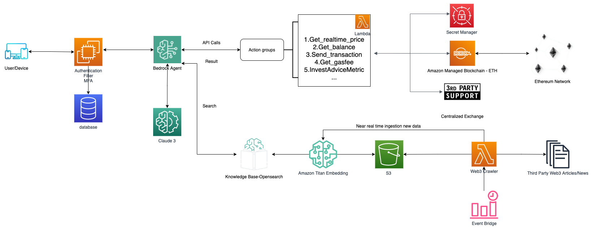

AI-powered Web3 agents have arrived!

As Web3 and generative AI technologies continue to rapidly evolve, building practical applications that combine these technologies presents a number of technical challenges. This blog demonstrates how to construct the fundamental building blocks of a Web3 AI Agent using AWS services. We'll show you how to leverage AWS Secret Manager as the agent's wallet, integrate generative AI capabilities, and implement other essential features to create a functional Web3 AI Agent.

Through this practical guide, you'll learn how to build fundamental components for Web3 AI agents, including:

* Set up a secure Web3 AI Agent using AWS services
* Implement wallet management
* Integrate generative AI capabilities
* Build Agents for blockchain interactions
* Build a knowledge base for Web3 news articles and data
* Deploy and manage your agent effectively

We will demonstrate how to create these fundamental building blocks in the context of creating a Web3 Intelligent AI Assistant. The core functionalities of this assistant will include:

* Smart Token Analysis and Real-time Price Queries
* Intelligent Blockchain Terminology Analysis and Gas Fee Estimation
* Real-time On-chain Address Balance Checks
* Investment Recommendations
* Smart Transaction Execution
* Near Real-time Web3 News and Data Aggregation

Technical Implementation

Workflow:

1. Users submit requests through their devices, passing through authentication and filter
2. Bedrock Agent processes requests by either:

    * Executing blockchain operations via Action groups including:
        * Get_realtime_price: Resolve token name and obtain its price
        * Get_balance: Query on chain address balance
        * Send_transaction: Execute on chain transactions
        * Get_gasfee: Get real-time gas fees
        * InvestAdviceMetric: Analysis of Investment Advice
    * Querying the knowledge base for Web3 information and data

1. The system continuously updates its knowledge base through crawlers
2. All blockchain interactions are handled through Amazon Managed Blockchain

Here’s the tutorial:

1. Create Agent

LLM Processing:
* Amazon Bedrock Nova pro is utilized as the LLM to comprehend user input

Prompt Sample:

You are a Web3 agent to make blockchain api calls and help user to invest, you can get current price of crypto currencies.
When user asks questions ,search answers in the attached knowledge base first and answer it accordingly. DO NOT answer directly without searching.
If user asks the price of a certain coin, call getCryptoPrice action group and send it the lowercase letter english name of that crypto, DO NOT use dialoge memory to answer.If customer asking you advice about whether he should buy crypto now, you can use investAdviceMetric Agent to calculate the trend and get a answer, then you can polish the answer and send it to user.If user asks about Gas，call estimateGas Agent.

In this prompt, we need to define that the LLM is a Web3 assistant and it needs to understand user’s question and call the related functions.  Every function should be declared here in order for the Nova model to know what function could be utilized.

1. Create an Action Group to enable your agent to coordinate various activities. The Action Group invokes one or more Amazon Lambda functions to carry out these actions such as obtaining data, and submitting transactions. You can select an existing Lambda function you have created, or select “Quick create a new Lambda function”. After the Lambda function is created, you can modify it as needed. In this case, the demo code is in ourpublic repository:

Attention: If you choose Select an existing Lambda function, remember to give the function a permission using below command:

aws lambda add-permission  --function-name Your-lambda-name --action lambda:InvokeFunction --statement-id agentsInvokeFunction --principal bedrock.amazonaws.com

For this demonstration, we have defined four Action group functions, each with its own set of parameters. These parameters are crucial for executing specific actions. When the Language Model (LLM) determines that an action needs to be taken, it will pass the relevant parameters to the corresponding Lambda function for execution.
Let's take an example to illustrate this process:
If we want to transfer some token to somebody, the "amount" and "receiver" parameters are needed to execute the transaction. Therefore, when creating an action group for token transfer, we need to define these parameters in advance.
The flow typically works like this:

    * The LLM interprets the user's request and identifies the appropriate action.
    * It then selects the correct action group and fills in the necessary parameters.
    * These parameters are then passed to the Lambda function, which executes the requested action.

This structure ensures that our AI assistant can perform complex tasks by breaking them down into predefined actions with clear input requirements.

In this agent-initiated transaction process, which involves operating the user's wallet, we should enable a confirmation action groupfor optimal security. This will prompt the user for a second confirmation, providing an additional layer of safety and ensuring the transaction aligns with the user's intentions.
 

1. Blockchain interaction:

* Go to Amazon Managed Blockchain 
* Generate a Polygon Access token
* Copy the Serverless Polygon endpoint into the Agent code in Lambda
* We use Secret Manager to manage private key here which can store any type of private keys from different blockchains. If you just require Ethereum or similar L2s, KMS signing would be another good option

The demo auto-send-tx code is shown below. It takes in the transfer parameters, signs the transaction and sends it to the network.

def sendtx(receiver,amount):
        print(f"Original receiver: {receiver}")
        
        # Resolve ENS domain
        resolved_address = resolve_ens(receiver)
        if resolved_address:
            receiver = resolved_address
        
        print(f"Final receiver address: {receiver}")

        # Get private key from Secret Manager
        sender_private_key = get_secret()
        # Define transaction parameters
        transaction = {
                'from': from_address,
                'to': receiver,
                'value': w3.to_wei(amount, 'ether'),  # Send Ethereum
                'gas': 21000,  # Set gas limit
                'gasPrice': w3.to_wei(150, 'gwei'),
                'nonce': w3.eth.get_transaction_count(from_address),
        }
        # Sign the transaction
        print(transaction)
        signed_tx = w3.eth.account.sign_transaction(transaction, private_key=sender_private_key)
        
        try:
            # Send transaction
            tx_hash = w3.eth.send_raw_transaction(signed_tx.raw_transaction)
        except Exception as e:
            # Handle exception
            print(f"Error sending transaction: {e}")
            return "Insufficient balance, transaction failed"
        # You can add other error handling logic here, such as logging errors, retrying, etc.
        else:
            # Transaction sent successfully
            print(f"Transaction sent with hash: {tx_hash.hex()}")

            # Wait for transaction to be mined
            tx_receipt = w3.eth.wait_for_transaction_receipt(tx_hash)
                
            print(f"Transaction successful with hash: {tx_hash.hex()}")
                
            return tx_hash.hex()

1. Create a central Web3 search platform using Bedrock Knowledge Base

* On the Amazon Bedrock console, in the navigation pane, choose Knowledge bases .
* Choose Create knowledge base with vector store.
* On the Provide knowledge base details page, set up the following configurations:

a.  Provide a name for your knowledge base.
b. In the IAM permissions section, select Create and use a new service role.
c. In the Choose data source section, select Web Crawler as the data source.
d. Choose Next.

* On the Configure data source page, set up the following configurations:

a.  Provide a name for  Data source name.
b. Under Source URLs, enter https://www.theblockbeats.info/en/newsflash.
c. For Sync scope, select Default.
d. For Parsing strategy, chose Amazon Bedrock default parser.
e. For Chunking Strategy, chose Default Chunking.
f.  Choose Next.

* On the Select embeddings model and configure vector store page, set up the following configurations:

a. In the Embeddings model section, choose Titan Text Embeddings v2.
b. For Vector database, choose Quick create a new vector store.
c. For Vector store, choose Amazon Opensearch Serverless
d. Choose Next.

* Review the details and choose Create knowledge base.
* 
* Once it has been successfully created, we need to sync the data source
* 

The entire architecture achieves functional connectivity and data flow through API calls, ensuring the real-time and scalability of the system. Each request of the user will be understood by AI, and then the corresponding agent function will be called to complete the specific business logic.

Demo

1. Use Nova pro model to parse token names and convert them into token codes to obtain real-time prices of corresponding tokens on the exchange

1. Retrieve corresponding real-time Gas Fees

1. Based on AMB, agent can obtain real-time on-chain balance with ENS domain.

You can switch to your own wallet to confirm:

1. Based on investment advice algorithms, the AI assistant can provide real-time recommendations on whether the current price is worth buying or not based on the current price.

1. Utilize Nova Pro to understand user intent and extract key information such as addresses and transfer amounts. This data is then passed to a back-end agent, which calls the Polygon API to execute on-chain transactions.

Once the agent completes execution, transaction status becomes viewable on the blockchain explorer.

1. Near real-time web3 news and data, helping investors or end users quickly obtain new market trends. This function serves as a centralized search platform, allowing users to access Web3-related information from various sources through a single interface, eliminating the need to search across different websites.

Moreover, the potential use cases of Web3 & AI integration extend far beyond these functionalities. For example, letting Agents automatically issue Meme tokens, create funny NFTs, and even design and deploy contracts directly on-chain, along with many other interesting scenarios. This solution just serves as a foundation for imagining and developing more practical features and products. 

Conclusion

In this post, we outlined the implementation of the Web3 AI agent with Amazon Bedrock, Amazon lambda and Amazon Managed Blockchain. To learn more about AI agent, see Amazon Bedrock. To learn more about other Managed Blockchain offerings, see Amazon Managed Blockchain.

If you’re ready to level up your own web3 AI agent, contact your AWS account team today to get started. The source code is already open sourced in Github repository. 

