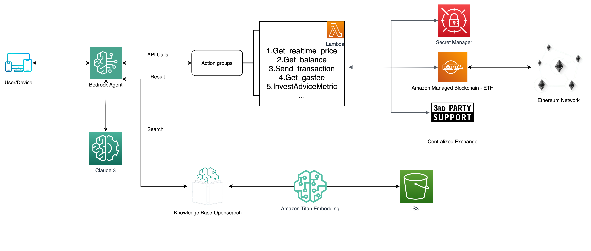

创建流程:

1. **AWS Bedrock Agent 部署**
   - 在 AWS 账户中创建一个新的 AWS Bedrock 项目
   - 配置 Bedrock Agent 的设置,包括 IAM 角色、环境变量等
   - 部署 Bedrock Agent 到 AWS Lambda 函数

2. **AWS Lambda 函数部署**
   - 在 AWS Lambda 服务中创建以下 Lambda 函数:
     - `Get_realtime_price`
     - `Get_balance`
     - `Send_transaction`
     - `Get_gasfee`
     - `InvestAdviceMetric`
   - 为每个 Lambda 函数配置相应的 IAM 执行角色和环境变量
   - 上传 Lambda 函数代码

3. **AWS Action Groups 配置**
   - 在 AWS Systems Manager 中创建 Action Groups
   - 配置 Action Groups 的通知目标,例如 SNS 主题或 Lambda 函数

4. **AWS Secrets Manager 配置**
   - 在 AWS Secrets Manager 中创建新的密钥,用于存储区块链私钥等敏感信息
   - 为 Lambda 函数和 Bedrock Agent 配置对 Secrets Manager 的访问权限

5. **Amazon Managed Blockchain 部署**
   - 在 AWS Managed Blockchain 服务中创建一个新的以太坊网络
   - 配置网络参数,如共识协议、节点类型等
   - 部署以太坊节点

6. **集成和测试**
   - 配置 Bedrock Agent 调用 Lambda 函数的映射关系
   - 测试用户/设备与 Bedrock Agent 的交互
   - 测试 Lambda 函数与以太坊网络的交互
   - 测试第三方支持服务（Coingecko）的集成
